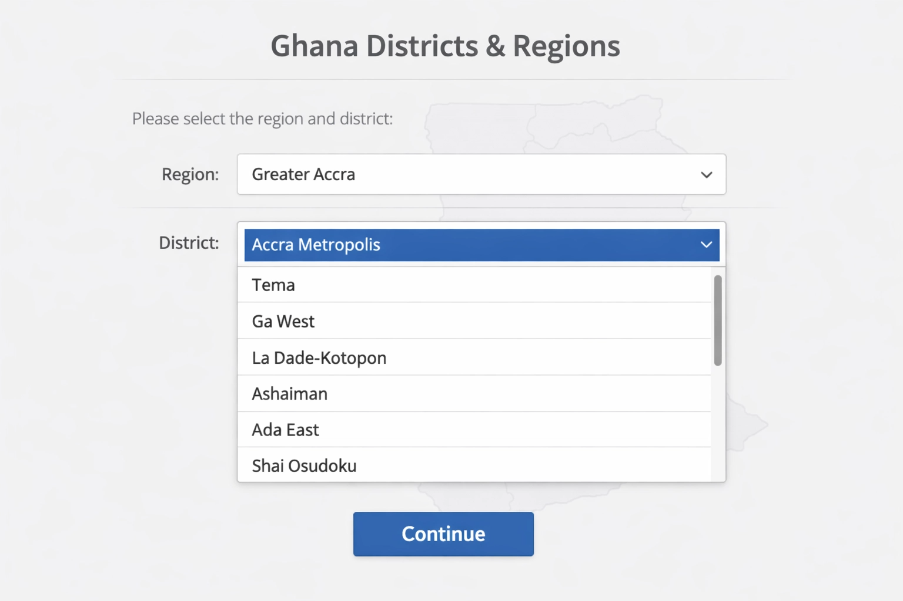
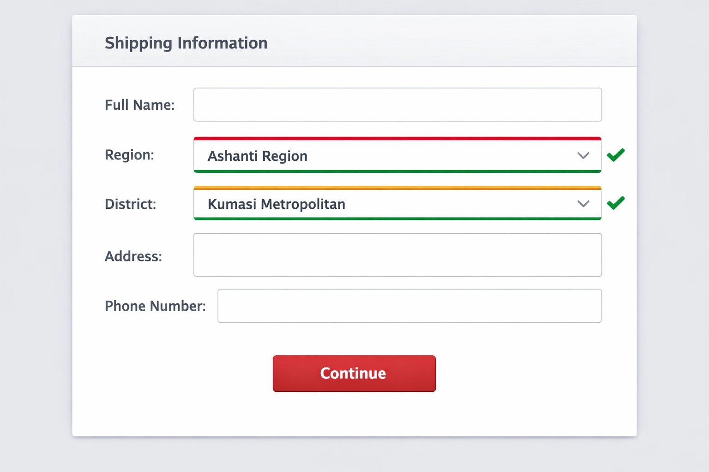
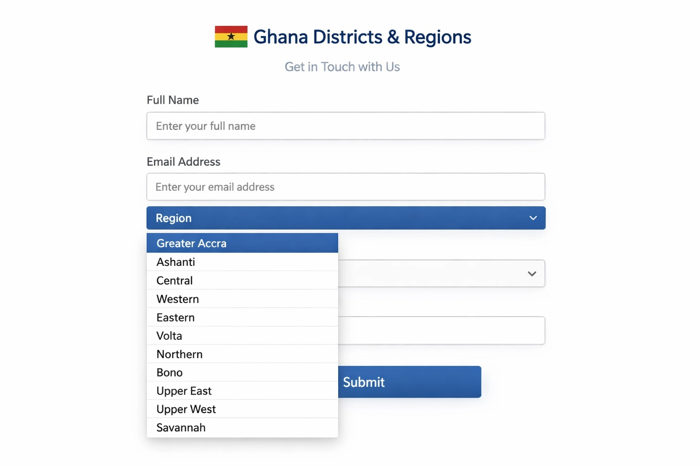

# Ghana Districts & Regions – Complete Address Fields

> Replace messy city text fields with structured Ghana region and district dropdowns on any WordPress site.

**Version:** 1.1.0 | **License:** GPL v2 or later | **Requires:** WordPress 5.0+, PHP 7.4+

[Get the plugin on WPBay →](https://wpbay.com/product/ghana-districts-regions-complete-address-fields/)

---

## What It Does

Adds proper **Region** and **District** dropdown fields to any WordPress page, post, or Contact Form 7 form. When a user selects a region, the district dropdown automatically populates with the correct districts for that region — no page reload required.

Covers all **16 Ghana regions** and **260+ districts** based on Ghana's current administrative structure.

---

## Features

- **All 16 Ghana regions** — including the newest regions created in 2019
- **260+ districts** — complete, accurate database for all regions
- **Smart cascading dropdowns** — district list updates instantly when a region is selected
- **Shortcode support** — drop `[ghana_regions]` and `[ghana_districts]` anywhere
- **Contact Form 7 integration** — native tag buttons appear in the CF7 form builder
- **Multiple instance support** — use several dropdown pairs on the same page using groups
- **Admin settings page** — shortcode reference and plugin info under Settings → Ghana Districts
- **Minified assets** — loads `.min.css` and `.min.js` in production, full files in debug mode
- **GPL-licensed** — open source, use freely on any site

---

## Screenshots

### District Selection (Shortcode)


### Contact Form 7 Integration


### CF7 Form Preview


---

## Installation

1. Download the plugin zip from [WPBay](https://wpbay.com/product/ghana-districts-regions-complete-address-fields/)
2. In your WordPress dashboard go to **Plugins → Add New → Upload Plugin**
3. Upload the zip and click **Install Now**
4. Click **Activate Plugin**

**Or manually:**

1. Upload the `ghana-districts` folder to `/wp-content/plugins/`
2. Activate through **Plugins → Installed Plugins**

---

## Usage

### Shortcodes

Place both shortcodes on the same page. Use the same `group` value to link them together.

```
[ghana_regions group="main"]
[ghana_districts group="main"]
```

**Available attributes:**

| Attribute | Default | Description |
|-----------|---------|-------------|
| `group` | `"default"` | Links a region dropdown to its district dropdown |
| `id` | auto-generated | Custom `id` attribute for the `<select>` element |
| `class` | `""` | Custom CSS class |

**Example with custom attributes:**
```
[ghana_regions id="billing-region" class="my-select" group="billing"]
[ghana_districts id="billing-district" class="my-select" group="billing"]
```

---

### Contact Form 7

Two new tag buttons appear in the CF7 form builder: **Ghana Region** and **Ghana District**.

Click each button, set a matching **Group** value in the tag generator, and insert the tags into your form.

**Example CF7 form tags:**
```
[ghana_region group:group1]
[ghana_district group:group1]
```

Both required-field variants are supported:
```
[ghana_region* group:group1]
[ghana_district* group:group1]
```

CF7 validation is built in — required fields will show an error if left blank on submission.

---

## File Structure

```
ghana-districts/
├── ghana-districts.php       # Main plugin file
├── readme.txt                # WordPress.org readme format
├── admin/
│   └── settings.php          # Admin settings page
└── assets/
    ├── css/
    │   ├── style.css
    │   └── style.min.css
    └── js/
        ├── script.js
        └── script.min.js
```

---

## Requirements

- WordPress 5.0 or higher
- PHP 7.4 or higher
- Contact Form 7 (optional — only needed for CF7 integration)
- jQuery (bundled with WordPress)

---

## Changelog

### 1.1.0
- Contact Form 7 native integration with tag generator buttons
- CF7 validation support for required fields
- `group` attribute for multiple dropdown pairs on the same page
- Improved JavaScript for CF7 dynamic forms and form resets

### 1.0.0
- Initial release
- All 16 Ghana regions
- 260+ districts database
- `[ghana_regions]` and `[ghana_districts]` shortcodes
- Admin settings page

---

## Support

- **Email:** ernestamart@gmail.com
- **WPBay listing:** [Ghana Districts & Regions](https://wpbay.com/product/ghana-districts-regions-complete-address-fields/)

---

## License

This plugin is licensed under the [GNU General Public License v2 or later](LICENSE).
